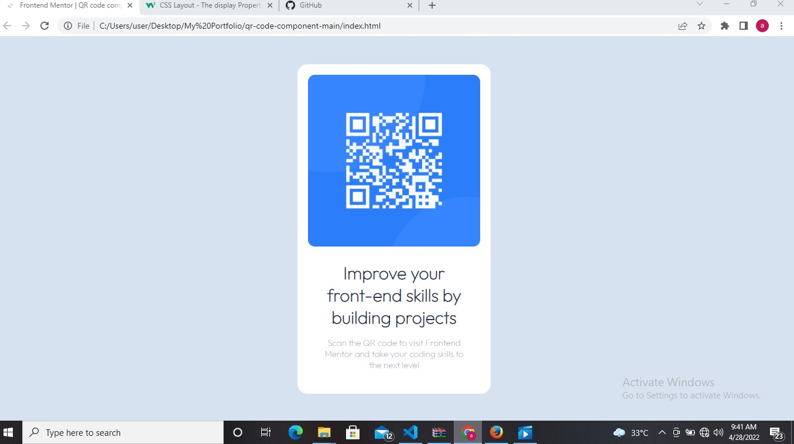

# Frontend Mentor - QR code component solution

This is a solution to the [QR code component challenge on Frontend Mentor](https://www.frontendmentor.io/challenges/qr-code-component-iux_sIO_H). Frontend Mentor challenges help you improve your coding skills by building realistic projects. 

## Table of contents

- [Overview](#overview)
  - [Screenshot](#screenshot)
  - [Links](#links)
- [My process](#my-process)
  - [Built with](#built-with)
  - [Continued development](#continued-development)
- [Author](#author) 

**Note: Delete this note and update the table of contents based on what sections you keep.**

## Overview

### Screenshot

### Links

- Solution URL: [Add solution URL here](https://maleekmoh.github.io/)
- Live Site URL: [Add live site URL here](https://maleekmoh.github.io/)

## My process

### Built with

- Semantic HTML5 markup
- CSS custom properties
- Flexbox

### Continued development
I took sometime figuring out the use of flexbox to position... I would focus more on the use of that

## Author

- Website - [Abdulmalik Mohammed](https://maleekmoh.github.io/)
- Frontend Mentor - [@Maleekmoh](https://www.frontendmentor.io/profile/Maleekmoh)
- Twitter - [@maleekmoh](https://www.twitter.com/maleekmoh)
